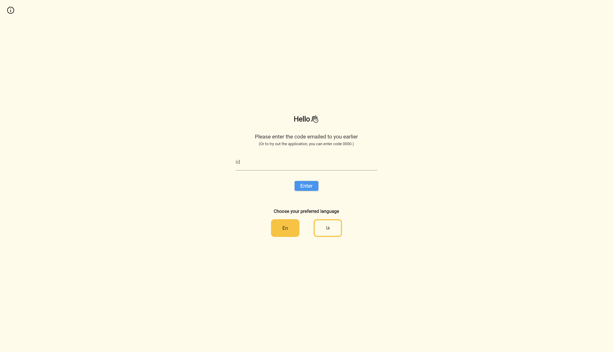
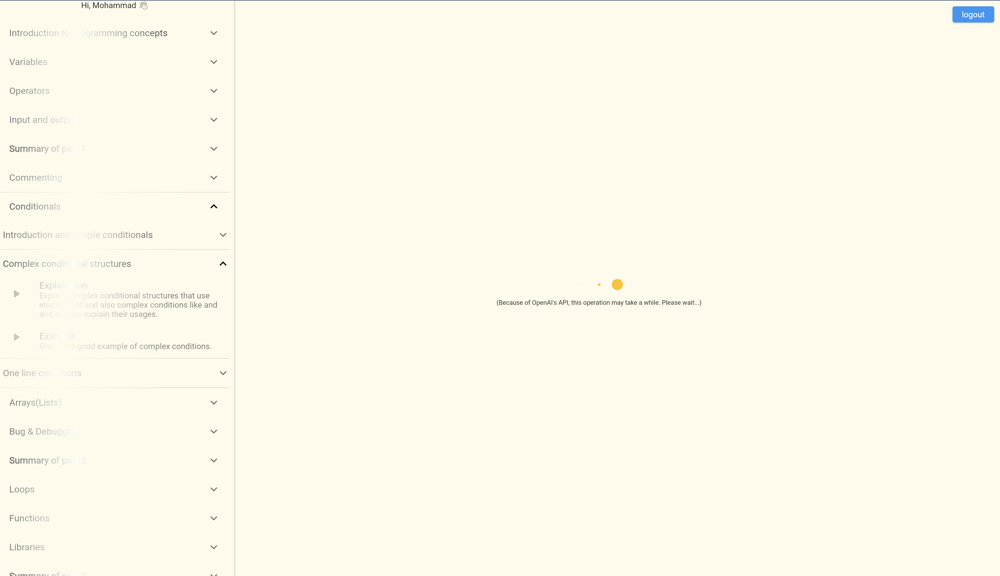
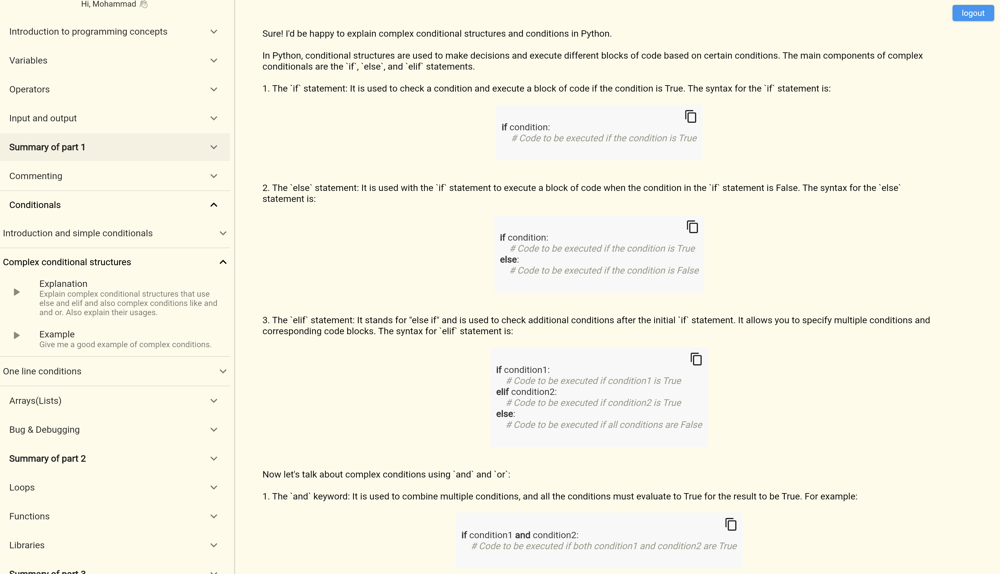

# learnprogramminwithgpt.com Frontend Code

This repo provides the frontend code for the [hci-research-gpt.web.app](https://hci-research-gpt.web.app/) website. (Formerly LearnProgrammingwithGPT.com)  
This website is intended to use for the research paper titled `Leveraging ChatGPT for Adaptive Learning through Personalized Prompt-based Instruction: A CS1 Education Case Study` and it uses OpenAI's API to use get answers.

# Introduction to the research and platform
A full introduction video to this platform can be found in the `Doc` direcory [here](<Doc/Video Presentation.mp4>). Also, following are some screenshots from the platform.

<figure>
  
  <figcaption>The initial page of the platform. One can enter their unique id to log in to the platform. This platform currently supports two languages: English and Persian</figcaption>
</figure>

<figure>
  
  <figcaption>This is the main dashboard of the platform. This is what a student sees while platform tries to get response from ChatGPT</figcaption>
</figure>

<figure>
  
  <figcaption>A response generated for the Explanation prompt of Complex Conditional Sentence subtopic</figcaption>
</figure>

